# 1 大数据概述

前置基础知识要求：

- Java SE
- Linux操作

环境参数：

- Linux centos6.4
- CDH(5.7)
- 开发工具：适合自己

大数据与机器学习的关系：

机器学习：火箭引擎--神经网络

大数据：火箭燃料

大数据是当今前沿技术的基石

大数据生态圈：

- Hadoop生态圈：Hadoop Hive HBase。。。
- Spark生态圈：Spark core， Spark streaming。。。

课程安排：

- 大数据概述
- 初始Hadoop
- 分布式文件系统HDFS
- 分布式资源调度YARN
- 分布式计算框架MapReduce
- Hadoop项目实战(mooc日志)
- Hadoop分布式集群搭建
- Hadoop集成Java EE(spring)的使用

## 1.1 大数据故事

足球界有数据分析软件，推荐系统，电商把假货卖给了谁

## 1.2 大数据背景

web2.0 ， 移动互联网， 数据的量与种类越来越多

## 1.3 大数据基本概念

定义：4V特征，Volume Variety Velocity(速度快，开始是基于日志的批处理，后来实时的流处理) Value(价值，沙里淘金，价值密度低)

要解决的问题：从快速的数据流转，多样的数据类型以及海量的数据规模中**挖掘数据价值**

## 1.4 大数据涉及到的技术

- 数据采集
- 数据存储
- 数据处理/分析/挖掘
- 可视化

## 1.5 大数据带来的技术挑战

- 对现有数据库管理技术的挑战：现阶段无法使用结构化的存储和查询
- 经典数据库技术并没有考虑数据的多种类别
- 实时性的技术挑战：推荐系统要求实时推荐
- 网络架构、数据中心、运维的挑战
- 数据隐私
- 数据源的复杂多样

挑战分析值如何对大数据进行存储和分析呢？

**系统瓶颈**：存储容量 读写速度 计算效率。。。

**Google大数据技术**： MapReduce BigTable GFS

google只发表了论文，并没有开放源代码

一个模仿Google大数据的开源实现：Hadoop HBase HDFS

## 1.6 大数据带来的变革

commodity computer

硬件故障，容错

## 如何需要大数据

**官网、官网、官网**

**英文、英文、英文**

项目实战对知识点进行巩固和融会贯通

社区活动：meetup 开源社区大会 线下沙龙

**切记：多动手、多练习、贵在坚持**

# 2 初识Hadoop

目录：

- Hadoop概述
- Hadoop的核心组件
- Hadoop优势
- Hadoop的发展史
- Hadoop生态系统(重点讲，生产中是多个框架组合使用)
- Hadoop发行版的选择：如何选择
- Hadoop企业应用案例

## 2.1 Hadoop概述

Hadoop名字的由来：孩子玩具的名字

hadoop.apache.org

**reliable scalable distributed computing**

hadoop框架的四个模块：

- Hadoop common：utilities
- HDFS: 分布式存储
- Hadoop YARN：任务调度与资源管理
- Hadoop MapReduce：基于YARN的并行处理框架

开源的 ， 分布式存储 + 分布式计算

**Hadoop能做什么？**

搭建大型数据仓库，PB级数据存储、处理、分析、统计等业务

搜索引擎

日志分析：大数据场景下，日志分析占绝大部分

商业智能

数据挖掘

## 2.2 Hadoop核心组件

### 分布式文件系统HDFS

源于Google的GFS论文，论文发表与2003年10月

HDFS特点：扩展性 容错性 海量数据存储

将文件切分成指定大小的数据块并以多副本的方式存储在多个节点

数据切分、多副本、容错等操作是Hadoop完成的，对用户是透明的，用户还是只需关注文件名，而不是数据块

为什么需要block ID：因为需要将多个block进行拼接，block ID保证有序

### 资源调度系统YARN

负责整个集群资源的管理和调度

比如提交作业时，作业占多多少内存，多少个cpu core

特点： 

- 扩展性

- 容错性：作业出现问题是，可进行一定次数的重试，重试次数可配置

- 多框架资源统一调度

### 分布式计算框架MapReduce

源自Google的MapReduce论文，发表于2004年12月

特点：

- 扩展性
- 容错性
- 海量数据离线处理

## 2.3 Hadoop优势

可靠性：

- 数据存储：数据块多副本

- 数据计算：重新调度作业计算

扩展性：

- 存储/计算资源不足，可横向的线性扩展
- 一个集群可包含数千节点

其他：

- 存储在廉价机器(相对小型机),降低成本
- 成熟的生态圈

## 2.4 发展史

2006年2月，Apache Hadoop项目正式启动

2007年10月，第一个Hadoop用户组会议召开

2008年1月，Apache顶级项目

2008年8月，第一个Hadoop商业公司Cloudera城西

2009年3月，收个Hadoop发行版CDH，完全由开发源码

2010-2011，大量新组建

2014年2月，Spark称为Apache顶级项目

## 2.5 Hadoop生态系统

### 狭义Hadoop VS 广义Hadoop

- 狭义Hadoop：是一个适合大数据HDFS，MapReduce，和YARN的平台
- 广义Hadoop：指Hadoop生态系统。生态系统中的每个子系统只能解决某个特定问题

### Hadoop生态系统

- HDFS：文件系统，存储数据
- YARN MapReduceReduce v2
- Hive：MR编程不方便，Facebook开源，解决海量数据统计。使用SQL语句，将SQL转换成MR
- Pig：脚本性语言，Yahoo开源，将脚本转成MR
- Oozie：工作流，调度引擎，层层审批。依赖关系，A的输出，作为B作业的输入
- zookeeper：管理组件的单点故障切换问题
- Flume：应用程序产生日志，将日志收集到HDFS
- Sqoop：关系性数据库中的数据抽取到HDFS或HBase
- HBase：bigtable的开源实现。数据库，快速的查询，实时查询大量数据

### 生态系统特点

- 开源、社区活跃
- 囊括了大数据处理的方方面面
- 成熟的生态圈

## 2.6 发行版选择

Hadoop常用发行版即选型

- Apache Hadoop:jar包冲突，生产不建议使用
- CDH： Cloudera Distributed Hadoop，通过CM的浏览器搭建集群，与Spark结合较好。采用相同的 版本，jar包冲突基本是没有的。缺点CM是不开源的。不同组件只需要CDH的版本一致。很多公司使用
- HDP : Hortonworks Data Platform，采用Apache纯开源，也自己的组件，但添加删除节点，管理等操作麻烦(与CM相比)

## 2.7 Hadoop企业应用案例

消费大数据：

根据之前的订单，在实际购买，下单前，就提前将货物放到货运中心，减少等待时间，提高用户体验

零售大数据：

啤酒和尿布，提高销售量

# 3 分布式文件系统HDFS

## 3.1 目录

- HDFS概述及设计目标
- HDFS架构(重点)
- HDFS副本机制
- HDFS环境搭建
- HDFS shell
- Java API操作HDFS
- HDFS文件读写流程(重点)
- HDFS优缺点

## 3.2 概述与设计目标

分布式存储需要考虑的问题(如朴素版分布式存储，只现实了以多副本的方式进行存储，有如下问题)：

- 不管文件多大，都存储在一个节点上，在进行数据处理时很难进行并行处理，节点可能称为网络瓶颈，很难进行大数据的处理
- 存储负载很难均衡，每个节点的利用率很低

HDFS设计：

将文件分块，副本存储

HDFS的设计目标：

- 非常巨大的分布式文件系统，满足大数据的存储
- 运行在普通的廉价的硬件上，如小型机的硬件费用是非常昂贵的
- 易扩展、为用户提供性能不错的文件存储服务

**官网Assumption and Goals**

## 3.3 HDFS架构

Master-slave

一个Master带N个slave，HDFS/YARN/HBase，都是这种架构。

Master：NameNode ，1.负责客户端请求响应；2.负责元数据(文件的名称、副本系数、block存放的DN)管理。文件系统namespace操作，打开，关闭，重命名

slave: DataNode ，数据读写。1.存储用户的文件对应的数据块；2.定期向NN发送心跳信息，汇报本身及其所有的block信息，健康状况

一个文件会被差分成多个Block

blocksize：默认128MB， 一个130MB的文件会被拆分成2个block

## 3.4 HDFS的副本机制

file system namespace是层级结构，与本地文件系统类似

replication factor

一个文件的所有block除了最后一个block，其他的block大小都是一样的

Files in HDFS are write-once (except for appends and truncates) and have strictly one writer at any time.

**HDFS副本存放策略**

假设3副本，2个机架。第一个副本会在客户端的节点上，第二个副本是在另一个机架的节点上，第三个副本与第二个副本在同一机架但不同节点

生产中至少两个机架

## 3.5 HDFS环境搭建

使用版本：Hadoop-2.6.0-cdh5.7.0.tar.gz从Cloudera官网下载

平台要求：推荐Linux，Java， sshd

- 安装jdk，JAVA_HOME配置到环境变量，JAVA_HOME/bin添加到PATH变量
- 安装ssh，配置免密码登录，因为NameNode与DataNode之间是需要ssh连接的

安装Hadoop(单机为分布式)：

- Cloudera官网下载Hadoop-2.6.0-cdh5.7.0.tar.gz，并解压
- etc/hadoop/hadoop-env.sh: export JAVA_HOME=....
- core-site.xml:HDFS默认文件系统的地址，fs.defaultFS hdfs://localhost:9000。core-site.xml默认配置数据存储在临时文件夹中，临时文件夹在Linux重启的时候会被删除，所以core-site.xml还要添加另一个属性：hadoop.tmp.dir /home/hadoop/app/tmp(如果不存在会自己创建)
- hdfs-site.xml:dfs.replication  1(一个节点)
- slaves：对于分布式集群要写，单节点为分布式可不配置

启动HDFS

- 启动HDFS：先格式化文件系统(仅第一次执行即可，不要重复执行。在客户端操作，所以切换到hadoop/bin目录下)：`hdfs namenode -format`
- 格式化完成后，启动NN和DN守护进程：`sbin/start-dfs.sh`
- 验证是否启动成功：`jps`或通过浏览器：http://localhost:50070

停止HDFS

- `sbin/stop-dfs.sh`
- **建议将$HADOOP_HOME/bin**配置到PATH变量

## 3.6 HDFS shell常用命令

hadoop fs/hdfs dfs -ls /

hadoop fs -put hello.txt /

hadoop fs -text/-cat /hello.txt

hadoop fs -mkdir -p /test/a/b

hadoop fs -ls -R /

hadoop fs -rm -R /test

hadoop fs直接回车，就出现帮助信息

## 3.7 Java API操作HDFS

开发环境：

- IDEA + Maven创建Java工程
- 添加HDFS相关依赖
- 开发Java API操作HDFS文件

问题：我们已经在hdfs-site.xml中设置了副本系数为1，为什么此时查询文件看到的是3呢？

如果采用hdfs shell的命令put文件的话，会采用默认副本系数1

采用Java API上传上去的，在本地我们并没有手工设置副本系数，所以采用的是hadoop的默认副本系数3

## 3.8 HDFS文件读写流程

### 角色

client：客户端，系统使用者，调用 HDFS API操作文件；与NN交互获取文件元数据；与DN交互进行数据读写。负责将文件查分成多个block

NameNode：元数据节点，是系统唯一的管理者。负责元数据的管理；与client交互进行提供元数据查询；分配数据存储节点等。

DataNode：数据存储节点，负责数据块的存储与冗余备份；执行数据块的读写操作

**数据写入**

replication pipeline

**数据读取**

HDFS采用的是“一次写入多次读取”的文件访问模型。一个文件经过创建、写入和关闭之后就不需要改变。这一假设简化了数据一致性问题，并且使高吞吐量的数据访问成为可能。

## 3.9 HDFS优缺点

优点：

- 数据冗余、硬件容错
- 处理流式的数据访问：指的是一次写入多次读取
- 适合存储大文件
- 构建在廉价的机器上

缺点：

- 不适合低延迟的数据访问
- 不适合小文件存储：小文件多，元数据占用内存大，对NN压力大

# 4 资源调度框架YARN

## 4.1 目录

- YARN的产生背景
- YARN概述
- YARN架构(重点学)
- YARN执行流程(重点学)
- YARN环境搭建
- 提交作业到YARN运行

## 4.2 YARN的产生背景

**MapReduce1.x存在问题**：单点故障，节点压力大不易扩展,不支持MapReduce之外的框架

MapReduce：Master/slave架构，1个jobtracker带多个tasktracker

Jobtracker：负责资源管理和作业调度

TaskTracker：

​	定期想JT汇报本节点的将空状况、资源使用情况、作业执行情况；

​	接受来自JT的命令：启动任务、杀死任务

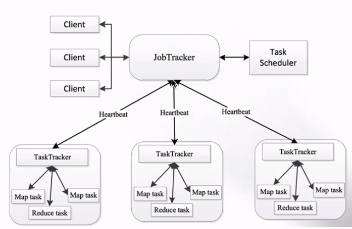

资源利用率低，运维成本高

由于上面的背景，就催生了YARN的诞生

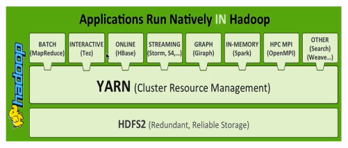

YARN:不同计算框架可以共享一个HDFS集群上的数据，享受整体的资源调度

XXX On YARN的好处：与其他计算框架共享集群资源，按资源需要分配，进而提高集群资源的利用率

XXX：Spark、MapReduce、storm、Flink

## 4.3 YARN的概述

- Yet Another Resource Negotiator
- 通用的资源管理系统
- 为上层应用提供统一的资源管理和调度

## 4.4 YARN架构

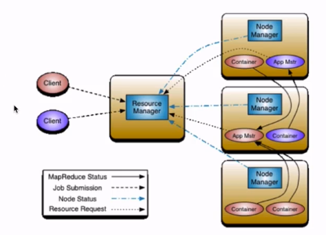

1. Resource Manager: RM
   - 整个集群同一时间提供服务的RM只有一个，生产是主备模式。负责集群的资源的统一管理和调度；
   - 处理客户端的请求：提交作业，杀死作业；
   - 监控NM，一旦某个NM挂了，那么该NM上运行的任务需要告诉我的AM来如何进行处理，如重启

2. NodeManager: NM
   - 整个集群中有多个，负责自己本身节点资源管理和使用；
   - 定时想RM汇报本节点的资源使用情况；
   - 接受并处理RM的各种命令：启动Container
   - 处理来自AM的命令
   - 单个节点的资源管理，有NM通过心跳来告诉RM
3. ApplicationMaster: AM
   - 每个应用程序(MR,spark)对应一个：负责应用程序的管理，为应用程序向RM申请资源(memory,core),分配给内存task；
   - 需要与NM通信：启动/停止task，task是运行在container里，AM也是运行在Container里
4. Container
   - 封装了CPUMemory等资源的容器，是一个任务运行环境的抽象
5. Client
   - 提交作业
   - 查询作业的运行进度
   - 杀死作业

## 4.5 YARN的运行流程

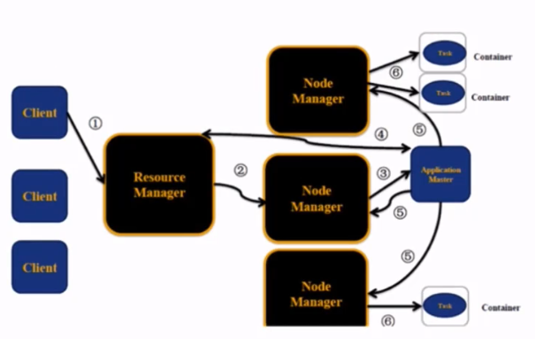

client提交作业--->RM---->NM启动AM----->AM注册到RM，并申请资源<====>RM，获得到资源后到对应的NM启动task Container

## 4.6 YARN环境搭建

单节点伪分布式：

- 使用版本：hadoop-2.6.0-cdh5.7.0
- yarn-site.xml:yarn.nodemanager.aux-services   mapreduce_shuffle(Spark的动态资源调度，需要该这里)
- mapred-site.xml: mapreduce.framework.name  yarn

启动：

```bash
sbin/start-yarn.sh
```

验证：

```bash
jps或通过浏览器http://localhost:8088
```

停止

```bash
sbin/stop-yarn.sh
```

## 4.7 提交作业到YARN执行

```bash
$ cd $HADOOP_HOME/share/hadoop/mapreduce
$ hadoop jar hadoop-mapreuce-example-2.6.0-cdh5.7.0.jar pi 2 3
```

后期，jar包是自己开发的，后面跟上相应的参数

#  5 分布式处理框架MapReduce

## 5.1 目录

- MapReduce概述
- MapReduce的编程模型
- MapReduce架构
- MapReduce编程(重点)

## 5.2 概述

源自Google的MapReduce论文，发表于204年12月

MapReduce优点：海量数据离线处理 易开发 易运行

MapReduce缺点：无法满足实时流式计算

流式：对于离线，输入数据集是静态，拆分后不变化。对于流式，是动态

MapReduce一个任务结束数据是要落地的。

## 5.3 编程模型

Word count：统计文件中单词出现的个数

Word count的用途：可以引申为访问URL的 top N。工作场景中的很多开发都是基于Word count改造的。

如，百度搜索的提示词，也是top N。被搜索的次数越多，就会被优先提示。

如果文件小，shell实现:

```bash
$ cat hello.txt | sed 's/[,.:;/!?]/ /g' | awk '{for(i=1;i<=NF;i++)array[$i]++;}END{for(i in array) print i,array[i]}'
```

如果文件内容很大，就需要大数据处理框架。

词频统计分析案例入门

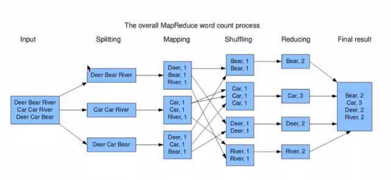

split:split the input data-set into independent chunks.通常一个Split对应一个HDFS的block

map:map之间没有依赖，并行处理.

shuffle:

reduce:

流程

准备map处理的输入数据，由框架完成。key必须是可序列化的，实现writable接口，还要求实现comparable接口

(input) `<k1, v1> ->` **map** `-> <k2, v2> ->` **combine** `-> <k2, v2> ->` **reduce** `-> <k3, v3>` (output)

k1:行号 v1:行号对应的文本

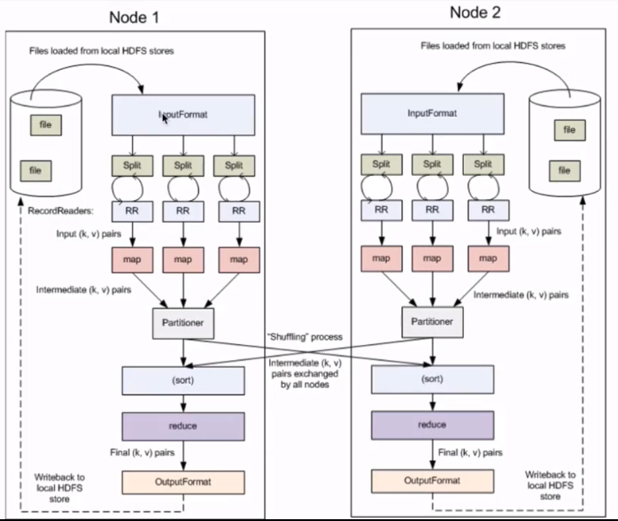

inputFormat:接口，描述MapReduce作业的输入规格。读取文本数据。

- 方法：getSplit，返回多个InputSplit数组。RecordReader：记录的读取器，将Split的数据读取进来。每读一行交由map处理

partitioner：相同的key放到一起

shuffle：

sort：

reduce：

OutputFormat:mapreduce输出格式。

整个流程：

文件通过**InpurtFormat**读取进来 ---> 拆分成一堆**split** ---> 通过**recordreader**把Split的数据读进来 --->读取的每一行交给map处理 ---> 处理后的结果按**partition**分区后 ---> 交个对应的reduce处理 ---> reduce处理完通过OutputFormat输出到文件系统

**MapReduce核心概念**

- split:交给MapReduce处理的数据块。是MapReduce中最小的计算单元
   - HDFS：blocksize是HDFS中最小的存储单元128M
   - 默认情况下：它们是一一对应的，生产中一般是默认。当然也可以手工设置它们之前的关系(不建议)
- InputFormat：将我们输入数据进行分片(Split)：InputSplit[] getSplot(JobConf, job, ......)
  - TextInputFormat:处理文本格式数据
- OutputFormat
- Combiner
- Partitioner

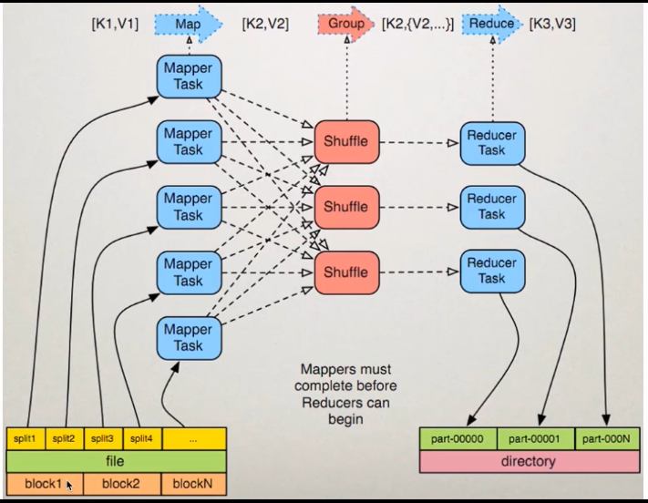

上图中出于演示的目的，将一个block拆成了2个Split。几个Reduce task，输出就是几个文件。

## 5.4 架构

**MapReduce1.x架构**

Jobtracker: JT

- 作业的管理者。
- 将作业分解成一堆任务：Task(MapTask和ReduceTask)
- 将任务分派给TaskTracker运行
- 作业的监控、容错处理(task作业挂了，重启task机制)
- 在一定的时间间隔内，JT没有收到TT的心跳信息，TT可能挂了，TT上云信的任务会被指派带其他的TT上执行

TaskTracker： TT

- 任务的执行者
- 在TT上执行我们的Task(MapTask和ReduceTask)
- 会与JT进行交互：执行/启动/停止作业，发送心跳信息给JT

MapTask：

- 自己开发的map任务交给该Task处理
- 解析每条记录的数据，交给自己的map方法处理
- 将map的输出结果写到本地磁盘(有些作业仅有map没有Reduce，此时就是写到HDFS)

ReduceTask

- 将map task输出的数据进行读取
- 按照数据进行分组传给我们自己编写的reduce方法处理
- 结果输出到HDFS，当然也可以输出到数据库

**MapReduce2.X架构**

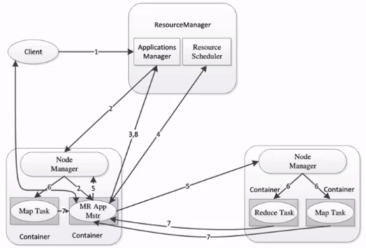

client:与1.x类似，用于提交MapReduce作业，检查作业执行状况，管理作业，申请资源等

## 5.5 编程案例

Wordcount Java实现：

- 首先自定义一个map类

使用IDEA+Maven开发WC：

- 开发
- 编译：mvn clean package -DskipTests
- 上传到服务器：scp target/hadop-train-1.0.jar hadoop@hadoop000:~/lib
- 运行：hadoop jar /home/hadoop/lib/hadoop-train-1.0.jar com.imooc.hadoop.mapreduce.WordCountApp hdfs://hadoop000:8020/hello.txt hdfs://hadoop000:8020/output/wc

相同的代码和脚本再次执行，会报错

security.UserGroupInformation:

PriviledgedActionExcption as:hadoop .......

Output directory hdfs://hadoop000:8020/output/wc already exists

在MR中，输出文件是不能实现存在的

- 先手工通过shell的方式将输出文件夹先删除
  - Hadoop fs -rm -r /output/wc
- 代码中完成自动删除(推荐)

**Combiner**

- 本地的Reducer
- 减少Map Task输出的数据量及数据网络传输量
- Combiner案例开发

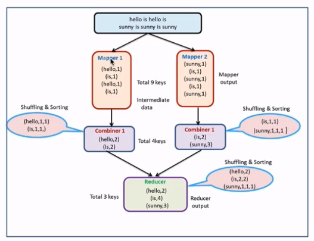

使用场景：

- 求和，次数
- 求平均数这种场景是不能使用Combiner的

**Partitioner**

- Partitioner决定MapTask输出的数据交由那个ReduceTask处理
- 默认实现：分发的key的hash值对Reduce Task个数取模

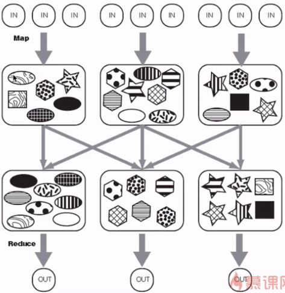

**Job History**:

- 记录已经运行完的MapReduce信息到指定的HDFS目录下
- 默认是不开启的，需要配置mapred-site.xml

```xml
<property>
    <name>mapreduce.jobhistory.address</name>
    <value>hadoop000:10020</value>
    <description>MapReduce JobHistory Server IPC host:port</description>
</property>
<property>
    <name>mapreduce.jobhistory.webapp.address</name>
    <value>hadoop000:19888</value>
    <description>MapReduce JobHistory Server Web UI host:port</description>
</property>
<property>
    <name>mapreduce.jobhistory.done-dir</name>
    <value>/history/done</value>
</property>
<property>
    <name>mapreduce.jobhistory.intermediate-done-dir</name>
    <value>/history/done_intermediate</value>    
</property>
```

配置完成后，先停掉yarn ,然后在重启，YARN启动后在启动hisotryserver

```bash
./mr-jobhistory-daemon.sh start hisotryserver
```

然后开启YARN的聚合功能，配置yarn-site.xml

```xml
<property>
    <name>yarn.log-aggregation-enable</name>
    <value>true</value>    
</property>
```

然后停止YARN，再启动YARN

# 6 Hadoop项目实战

## 6.1 目录

- 用户行为日志：基于慕课网的访问日志
- 项目需求
- 功能实现：使用Hadoop相关技术

## 6.2 用户行为日志概述

为什么要记录用户行为日志

- 定义：用户每次访问网站时所有的行为数据(访问、浏览、搜索、点击。。。)，还包括用户行为轨迹、流量日志

- 日志用途：

  - 网站页面的访问量
  - 网站的黏性
  - 推荐：根据记录，打标签，如你正在装修，目的是为了产生新的订单。
  - 协助推销方案

- 用户行为日志生成渠道

  - Nginx：web的访问日志
  - Ajax：嵌入js代码，获得鼠标停留时间，发到后台

- 用户行为日志的内容

  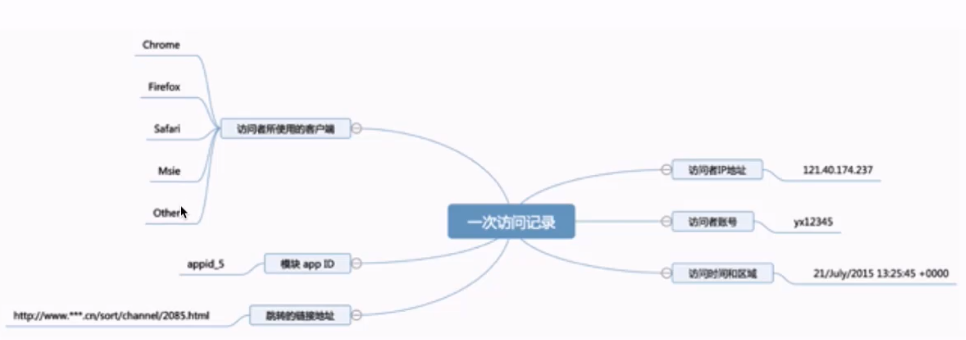

日志数据内容分类：

- 访问的系统属性：操作系统、浏览器等等。比如你是手机端访问，会给你一些优惠，鼓励使用移动端，这些可同操作系统获取
- 访问特征：点击的URL、从那个url跳转过来的(referer)、页面的停留时间
- 访问信息：session_id、访问的IP(通过IP获取地市，运营商，如果某一个商品，它在某一个城市它的访问量非常非常高，这就意味这这个商品或课程在哪个城市比较受欢迎，可用于商品的推广，所以访问IP非常重要)

日志数据实例：

```
2013-05-19 13:00:00     http://www.taobao.com/17/?tracker_u=1624169&type=1      B58W48U4WKZCJ5D1T3Z9ZY88RU7QA7B1        http://hao.360.cn/      1.196.34.243
```

用户行为日志分析的意义：

- 网站的眼睛：通过分析可知访问者来自于哪里，访问者在找什么东西，哪些页面受欢迎，访问者是从那个地方进来的，就是我们的referer,这个referer就有一定的说法了，比如说你在百度做推广，给他付钱了，那么一个月到底从百度那里引流过来多少流量过来，这是每个月都要做评估的。如果投了钱，广告效果还不好，那就意义不大了。
- 网站的神经：对于一个好的网站来说，在什么位置放置什么功能，这是非常有讲究的。网页的布局是否合理，对用户的体验是非常重要的。这就是转换路径问题
- 网站大脑：根据地市统计课程的流量，欢迎程度，来确定广告的投放比重

## 6.3 离线数据处理架构

### 6.3.1 离线数据处理流程(重点)

**1 数据采集**

当访问慕课网的主站，或者通过手机APP的方式进行访问的时候，每一个操作都会有一个请求发送到后台服务器，如tomcat，Jboss等。大量用户高并发情况下都是用nginx接受请求，然后进行转发，负载均衡。日志产生以后如何进行采集呢：

Flume：web日志写入到HDFS，本课程不设计采集。直接将日志文件放到HDFS中

**2 数据清洗**

因为第一步采集过来的数据是存在脏数据的，如不符合日志规范的，要剔除

清洗过程中可使用的组件有Spark/Hive/MapReduce或其他的分布式计算框架

清洗完之后的数据可以存放在HDFS(Hive/Spark SQL)

**3 数据处理**

关键阶段，按照需求进行相应业务的统计和分析

采用Spark/Hive/MapReduce或其他的分布式计算框架

**4 数据处理结果入库**

在第三部的基础上，将统计结果，如最受欢迎课程的Top N，那这个Top N算出来以后可以存放到RDBMS(如MySQL等)、NoSQL(HBase、redis、ES等)。

调用RDBMS或NoSQL的API就能完成

**5 数据的可视化展示**

将入库的结果通过图形化的方式展示出来：饼图、柱状图、地图、折线图

Echarts：百度开源

HUE：

Zeppelin：

### 6.3.2 离线数据处理架构(务必掌握)

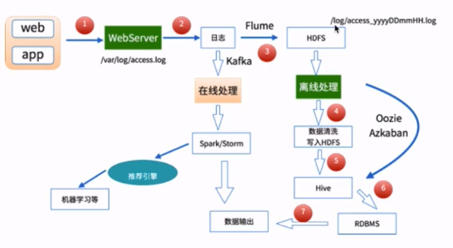

通过pc端的浏览器或手机的APP访问主站，访问操作的过程通过nginx记录下来存放到access.log中。这些日志信息都在nginx服务器中，通过Flume将日志抽取到HDFS，/log/access_yyyyDDmmHH.log,每1小时抽取一次。按什么时间抽取根据业务确定。下面进行清洗，清洗后继续存储在HDFS上。接着使用Hive，Spark sql等将数据处理后存储到RDBMS或NoSQL中。之后就可以通过图形化进行展示了。

还有一条线：Flume收到数据后，存储在Kafka中，进行在线实时处理。采用Spark streaming或storm等完成在线统计，统计完成后给推荐引擎，然后进行机器学习等相关处理。

离线处理一般是凌晨执行昨天的数据，那什么时候进行执行？总不能零点自己手动执行，所以，离线处理还需要使用Oozie/Azkan完成作业的调度。在每天几点进行离线处理，比如清洗--->处理---->RDBMS，将整个流程串起来就可以通过Oozie/Azkaban将流程串起来，只有前面的处理完，才能进行下一个作业。

## 6.4 项目需求

**需求：统计imooc主站访问日志的浏览器的访问次数**

信息在日志的useragent字段中

## 6.5 功能实现

根据日志信息抽取出浏览器信息：在github找相关工具，User Agent Parser

针对不同的浏览器进行统计操作

使用别人的源码：

```bash
git clone 
maven 编译
```

编译完成的jar包不能在IDEA中使用，因为本地仓库没有，所以要把这个包打到本地仓库

```bash
mvn clean install -DskipTest
```

# 7 Hadoop分布式环境搭建

## 7.1 目录

- 环境介绍
- 前置配置：jdk ssh免密
- 集群搭建
- 集群使用

## 7.2 环境介绍

三个节点：

hadoop000:192.168.199.102

hadoop001:192.168.199.247

hadoop002:192.168.199.138

直接克隆hadoop000,然后修改下列配置为对应信息：

```bash
# vi /etc/sysconfig/network
NETWORKING=yes
HOSTNAME=hadoop001
```

hostname和IP地址的设置

```bash
vi /etc/hosts
192.168.199.102 hadoop000
192.168.199.247 hadoop001
192.168.199.138 hadoop002
```

角色设置：

hadoop000: NameNode/DataNode ResourceManager/NodeManager(3副本，机器少)

hadoop001: DataNode NodeManager

hadoop002: DataNode NodeManager

## 7.3 前置配置

- ssh免密登录：配置Master能免密登录本机即其他DataNode
- jdk安装：在hadoop000上安装，然后拷贝到其他机器

## 7.4 集群搭建

1. Hadoop安装：解压，配置环境变量HADOOP_HOME，记得source

2. 配置文件：

   - hadoop-env.sh:配置JAVA_HOME
   - core-site.xml:配置default name：fs.default.name  hdfs://hadoop000:8020
   - hdfs-site.xml:配置文件系统存放的目录,默认三副本：name:dfs.namenode.name.dir value:/home/hadoop/app/tmp/dfs/name , name:dfs.datanode.data.dir  value:/homehadoop/app/tmp/dfs/data(因为Master也作为datanode，所以要配置data的存储位置)
   - yarn-site.xml: name:yarn.nodemanager.aux-services value:mapreduce_shuffle , name: yarn.resourcemanager.hostname value: hadoop000(声明YARN resourcemanager跑在那个节点上)
   - mapred-site.xml:只需要配置其框架为yarn, name:mapreduce.framework.name value:yarn
   - slaves:从节点

3. 分发安装包到hadoop001和hadoop002:

   ```bash
   # scp -r ~/app hadoop@hadoop001:~/
   # scp -r ~/app hadoop@hadoop002:~/
   # sc p ~/.bash_profile hadoop@hadoop001:~/
   # sc p ~/.bash_profile hadoop@hadoop002:~/
   ```

   在hadoop001和hadoop002上让.bash_profile生效

4. 对namenode做格式化：只需要在hadoop000上执行

   ```bash
   # ./hdfs namenode -format
   ```

5. 启动集群：sbin/start-all.sh

6. 验证

   - jsp
   - web UI ：hadoop000:50070, hadoop000:8088

7. 停止集群：sbin/stop-all.sh

# 7.4 集群使用

学习过程中使用伪分布式的单节点是绝对没有问题的

# 8 Hadoop集成Spring的使用

- Spring Hadoop概述
- Spring Hadoop开发环境搭建即访问HDFS
- Spring Boot访问HDFS

# 10 Hadoop3.x新特性

- 概述
- Common主要改进
- HDFS主要改进
- YARN主要改进
- MapReduce主要改进
- 其他


