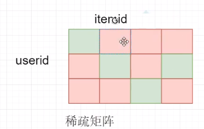

# 1 典礼与常见业务

## 1.1 典礼

### 1.1.1 上课方式

- 基础理论部分：录播，需要提前复习
- 实践部分：直播。面试官比较关注实践能力，但理论基础也是很必要的
- TODO LIST：明确哪些是属于理论，哪些属于实践

学习模式：预习 + 复习

预习：录播视频、

复习：直播视频。课程结束将视频发送到网盘

### 1.1.2 上课纪律

- 空杯心态：背景，知识结构等不同
- 100%热情投入：至少30此课，时间宝贵
- 坚持不懈，一定要有信息
- 人之所以痛苦，在于追求错误的东西：学习是比较痛苦的

### 1.1.3 经验

目标：找大数据工作，少走弯路

方法：找猎头？求职网站？多年工作经验的一般都是人脉内推。这都是渠道问题，但有渠道依然不能成功。

策略：为了达到目标，需要做好准备：

1. 简历：硬件，学历，从事什么行业，做过什么项目。硬件是敲门砖。简历需要提前规划。能力不能通过简历体现出来。
2. 修养：软件，内在修养。简历是创造机会，修养是把握机会。
   - 工作前：跟面试官：先讲项目，大数据有整体的把握，讲架构。然后讲细节，讲理论。
   - 工作后：进入大数据行业。优化灵魂。对不了解的东西进行学习。跟老板讲新的故事。

### 1.1.4 我们的故事长什么样子

开发语言：Linux系统命令，Python，Java， c++, shell, sql, scala

开发工具：linux, hadoop, spark, tensorflow , pytorch

开发方式：shell， vim， IDE(idea)

不是培训语言，工作中最重要的是架构，思路，方法

### 1.1.5 项目

每次课设计这个项目的一部分，最后整体将项目呈现。

项目名称：音乐推荐系统，不要过于入戏太深。不要认为只给音乐服务。任何物品都可以做成推荐系统。甚至可以不搞推荐，可以搞搜索，搞反作弊。关键是举一反三。

### 1.1.6 大数据学习

从Hadoop生态圈开始：工作中尽可能不重复造轮子

- HDFS(底层)：分布式文件系统，存储
- Hbase: 分布式数据库，基于HDFS，存储
- MapReduce，storm， Spark(计算框架)：MR：离线，批量。storm：实时计算。Spark：Spark Core(批量)，Spark streaming(实时)，Spark ML(机器学习)，Spark SQL用于统计。
- Hive：SQL引擎，本质是MapReduce。why：MR需要专业的人写，但SQL很多人都会，简便于工作，通常用于统计。
- mahout：机器学习
- webserver:除了生态组件，还需要与企业项目结合，将服务提供出去，需要webserver 作为出口。
- zookeeper：全局锁，集群级别

课程整体包含三个部分：

1. 大数据平台：Hadoop， Spark。Hadoop生态圈
2. 服务器开发(日志流)logserver：呈现完成的webserver。以nginx向外提供服务，后端有多个server
3. 数据挖掘(机器学习)

项目过程中上面的3个部分是紧密结合，并不是独立的

算法：

首先以单机的形式了解原理--->然后在分布式场景下进行处理：mr + spark--->TF, pytorch

以上面的工具实现：

分类算法

推荐算法

聚类算法

## 1.2 常见业务

### 1.2.1 搜索引擎

以前：返回搜索的内容

现在：返回服务，比如搜温度，不仅要返回温度，还要提供穿什么衣服，注意什么等服务

大数据哪里来：人产生的

音乐(物品item)--->itemid(一串数字或字母)

用户(人user)----> userid

大数据：用户多，物品多。想做推荐，前提是有很多物品

用户多：自然产生用户行为多(用户行为挖掘)

物品多：就会产生大量元数据(Metadata)

元数据：物品的属性schema(描述数据的数据)

用户行为数据：通常是通过监控实时获取的

正排索引：item--->token token token...

倒排索引：token--->item item item....

检索系统：

第一步：召回阶段，用token检索item

第二步：过滤阶段：把劣质的item过滤掉

第三步：排序，把好的item排前面

第四步：截断，top N

第一步与第二步是，粗排，用于召回

第三步与第四步是，精排，侧重于准确

不同的token检索出相同的item，这时就需要merge，这是在检索阶段的merge

另一中merge场景：分布式环境下，不同的server上的相同item进行merge

merge后的结果放到索引库

京东，淘宝：搜索商品

### 1.2.2 广告系统

搜索广告

展示广告

### 1.2.3 推荐系统

学习重点：

1. 检索/推荐系统定位
2. 架构/框架层次

online： webserver + nosql

nearline: real time analysis(strom / stream)---->实时计算产生的数据---->结果插入nosql

offline:MapReduce(计算昨天的数据)---->结果插入nosql

### 1.2.4 其他

金融，反欺诈

## 1.3 下次计划

下次讲解内容：

1. 架构思路
2. MapReduce----不讲理论，按复习的思路将
3. 简易的推荐系统

预习内容：

1. MapReduce、HDFS录播
2. 搭建hadoop-2.6.5环境

**画图软件：迅捷流程图制作软件**

# 2 整体架构+MapReduce+pyweb

## 2.1 整体架构

从另外一个角度看整体架构，看课程中要学习那些知识点与技术，整个架构中这些知识点可以用在哪些环节。

### 2.1.1 检索引擎

索引库(nosql，这里用redis)---->检索引擎---->UI(url, app)webserver，这里用pyweb代替---->用户

索引库中存储的好友关系，音乐间的关系，榜单等信息是通过数据挖掘平台使用推荐算法，分类算法，聚类，NLP等技术生成的；数据挖掘平台使用的算法依赖于数据源，数据源包括：物品元数据，用户画像，用户行为(用户对物品的行为，如收藏点击购买等）等。

数据挖掘平台对接的数据源一定是结构化数据，如果RDBMS中的表格。结构化数据来自与非结构化数据，非结构化数据如log, `http://xxx.com?userid=111&itemid=222&type=click&ip=1.0.0.10&.....`

上面的这条日志来源于webserver，webserver有很多，APP记录用户行为发送到后端webserver。

原始日志包含大量噪音，要将有价值的数据提取出来变成结构化数据。由非结构化数据到结构化数据要进行数据清洗。

物品元数据哪里来：视频由用户驱动产生的内容叫UGC，量大，但质量参差不齐。PGC有电影或音乐厂商专业的物品信息。

结构化的数据还有一种来源，通过发布系统(CMS)，在后台发布系统上填写物品相关信息。

报表系统：从结构化的数据产生的，报表系统给内容提供商参考，提供商调整发布系统内容。报表系统供调研分析系统，给运营，产品经理，管理者。运营分析后，将需求发布给工程师。

工程师有两种：

- 关心业务的：通过配置服务器控制检索引擎。**配置服务器**：控制投放控制。地域控制。比如网易云音乐，在国内可访问，国外不可以。有些音乐是有地域限制的，即不能在国外访问，当用户在国外方访问的时候，服务器会获取到用户的IP，就直接禁止访问了。
- 不关心业务的：运维，只关心服务是否健康运行。离不开监控系统，监控数据库，检索引擎，监控平均响应时间。平均响应时间很重要。降低平均响应时间，在访问量不变的情况下，就节省资源。nagois，zabbix

UI：用户访问的页面

检索系统：使用pyweb快速实现UI。后期将pyweb升级成nginx，cgi。webserver，APP，逻辑

索引库：redis， hbase

数据挖掘平台：Hadoop，Spark， tensorflow，pytorch，单机版的如sklearn

结构化数据：通过MapReduce，Spark等处理

行为日志收集与清洗：flume kafka storm streaming 落地到HDFS或HBase上

发布系统：消息队列，Kafka，activemq

报表系统：Hive，HBase，Spark sql

配置服务器：zookeeper，全局分布式锁。整个集群中最权威的人。管理引擎机器，很多公司通过zookeeper做发布

## 2.2 MapReduce

用复习的方式将，不讲太多理论

1. MapReduce HDFS同节点部署，数据本地化，就近原则
2. 通常一个集群中有Master，slave，client角色。client连接Master，跟从之间做一些任务的发布
3. 为什么副本机制：数据高可用
4. 分而治之：一个是分：将大量数据做小的切片，一个Split与一个map是一对一的关系。另一个是合：Reduce
5. map到Reduce过程中，有一个partition，分发，相同的key分发到同一个partition。还有一个排序，代码中没有写排序，是在map阶段从buffer in memory(内存中)往磁盘spill的时候(这里有个水位线80%，当达到水位线时,锁住这80%，开始排序，最后spill到磁盘)，在memory中进行的排序，因为快。磁盘中的小文件是有partition分区的，然后合并成一个大的文件，并把大文件的partition发到不同的Reduce。
6. RR：recorder Reader，map只识别RR，而HDFS的单位是block，将一个block包装成一个RR，然后输入给map。比如一个完整的句子，被block切碎了，分别存储在两个block上，则在组装RR的时候，会把切碎的第二个block上的句子合并到第一个block中，形成一个完整的句子来组装成一个RR。
7. shuffle：神奇发生的地方，性能优化大有可为的地方。
   - partition：分发
   - sort：排序
   - spill：内存溢写到磁盘
   - merge：
   - Combiner：不是必须的，一般不用。用不好会拖累程序的速度
   - copy：
   - memory：
   - disk：
8. 开发Java相当于开发函数，开发Python等脚本，相当于规定好标准输入和输出。为什么开发普通脚本，就是开发标准输入和输出呢？是因为用非Java语言开发的MapReduce它是运行在Hadoop streaming的框架中，而Hadoop streaming要求你是标准输入和标准输出的。
9. Hadoop 1.0
   - 主：jobtracker，NameNode
   - 从：tasktracker，datanode
   - 进程：worker。所有任务都运行在进程中
10. Hadoop 2.0
    - 主：resourcemanager(RM资源调度)，ApplicationManager(AM任务调度)
    - 从：nodemanager(NM)
    - 所有任务都运行在容器(container）中
11. 单机调试：cat input | mapper | sort | reducer > output

实践总结：

整体情况：Hadoop-2.6.5

3个节点：1个Master，2 个slave

Master：192.168.87.10

slave1：192.168.87.11

slave2：192.168.87.12

页面观察：

HDFS页面：http://192.168.87.10:50070/dfshealth.html#tab-datanode

yarn管理页面：http://192.168.87.10:8080/cluster

client提交map.py red.py分发到slave1和slave2.每个节点的机器，会各自读自己的split，然后供代码使用，每个map产生的数据或落地到磁盘

节点上，client分发的目标path：

/usr/local/src/hadoop-2.6.5/tmp/nm-local-dir/usercache/root/apache/application_1543137200099_0011/container_1543137200099_0011_01_000001

告诉大家的目标路径的原因：目前的代码还是比较简单的，后面使用了中文分词，远程的节点是不支持中文分词的，此时需要在客户端把中文分词或其他包分发到远程节点。

杀任务：yarn application -kill application_1543137200099_0011

第一个代码：wordcount

第二代码：全排序，有两种方法：单reducer，多reducer

- 单reducer：第一个代码：`mr_allsort_1reduce_python`目录，使用了`base_count`。第二个代码：`mr_allsort_1reduce_python_2`目录，使用配置。依赖于框架自身的sort，但是数据量大的话在一台机器上可能会很慢。通过`-jobconf "mapred.reduce.tasks=1"`配置强制只有一个桶，即只有一个reducer。一种方式通过`base_count`将key对齐，因为排序是按字典（字典是按字母排序，即100排在11前，Linux命令中使用sort -n解决）排序。另外一种方式：
  - -partitioner org.apache.hadoop.mapred.lib.KeyFieldBasedPartitioner 利用该配置可以完成二次排序，用那个key做partitioner
  - -jobconf  org.apache.hadoop.mapred.lib.KeyFieldBasedComparator 利用该配置可以完成key排序，如何比较
  - -jobconf stream.num.map.output.key.fields=1 设置map分隔符的位置，该位置前的为key，之后的为value。这里的1代表第一列是key
  - -jobconf mapred.text.key.partitioner.options="-k1,1" 选择哪一部分做partition, `-k1,1`表示从第一个字段开始，到第一个字段结束，也就是第一个字段。选取了第一个字段做partition，做partition是分桶用的，
  - -jobconf mapred.text.key.comparator.options="-k1,1n"  设置key中需要比较的字段或字节范围。只对key做排序，且按数字排序，所以用了`n`，如果没有`n`，回去用字典去排序。
  - -jobconf mapred.reduce.tasks=1
- 多reducer：扩展性更强，适合大数据。代码目录为`mr_allsort_python`(多桶，用到了base_count).这里的关键是下面的4个配置，且会经常会用到：
  - -jobconf mapred.reduce.tasks=2设置多少个reducer
  - -jobconf stream.num.map.output.key.fields=2 发到reducer中的数据还未排序，所以要进行二次排序。`2`表示前面2个字段作为排序的key
  - -jobconf num.key.fields.for.partition=1 partition key的设置，用于分发
  - -partitioner org.apache.hadoop.mapred.lib.KeyFieldBasedPartitioner

第三个代码：白名单，分发的例子

- -file把本地(提交命令的这台机器)文件发送到各节点，从client发送
- -cachefile把HDFS的压缩文件分发到各节点，支持单个文件
- -archivefile把HDFS的压缩目录分发到各节点，多个文件打包成一个目录，到节点后会自动解压目录
- 压缩的格式是gz.使用`tar czf `命令完成

**压缩**

为什么要压缩：减小带宽传输。可以在两个阶段压缩：一个是map到reduce的过程中做一次压缩；另一个是mapreduce输出的时候压缩。压缩后产生的是gz扩展名的压缩包，不是明文。如果想控制map的个数，可以采用这种方式，因为压缩后的大数据不会在split。map的个数不是越少越好，map的个数少，运行的会比较耗时，map的个数越多，就越消耗更多的资源。

**join**

相同的key，把两列value拼到一起。重要配置：

-jobconf stream.num.map.output.key.fields=2 
-jobconf num.key.fields.for.partition=1

## 2.3 简易的demo

通过一个简单的demo，让大家能快速的理解检索系统。后续的课程将在demo的基础上让其变得更加复杂。

## 2.4 下次计划

1.  NLP：tfidf   关键词提取 lcs
2. 中文分词：jieba，如果与MapReduce结合。将分词运用到大数据上。如果将jieba与pyweb结合起来，形成小的案例，一个远程分词服务。为后面讲storm做准备。

要想推荐，必须分词

机器学习，算法，以Python为主；讲Spark以scala为主；讲Hive，sql，udf以Java为主。

下周预习内容：所有视频，包含今天的直播。

MapReduce现在用的很少了。

# 3 文本相似度

## 3.1 NLP

NLP：自然语言处理，做一些分词，句子间相似度的计算。包括处理文本。

**相似度**：任务两个实体间的关系

相似度和距离之间的关系：越相似，距离越进。

## 3.2 文本相似度

语义相似：两句话字面不相似，但语义相似。

​	老铁的个人简介

​	铁匠的人物介绍

字面相似：字面相似、但语义不相似

​	我吃饱饭了

​	我吃不饱饭

解决方案：

- 语义相似：依靠用户行为，基于用户行为的统计，实现文本间的关联。

​			歌神 -> 张学友

  		1. 基于共点击的行为(协同过滤)
                		2. 借助回归算法

- 字面相似：

  1. LCS算法，最大公共子序列

  2. 利用中文分词：把两句话分词后，再求相似度

     老铁的个人简介  ==>  老铁/的/个人/简介

### 3.2.1 字面相似度的问题解决

1. 余弦相似度：consine一个向量空间中，两个向量夹角的余弦值作为衡量两个向量之间差异的大小。余弦值接近1，夹角趋于0，表明两个向量越相似。如果不是二维空间，而是n维，则用下面的表达式：

   
   $$
   cos(\theta) = \frac{\sum_{i=1}^nx_i\times y_i}{\sqrt{\sum_{i=1}^n(x_i)^2}\times\sqrt{\sum_{i=1}^n(y_i)^2}} = \frac{a\cdot b}{\left \|a\right\|\times \left \|b\right\|}
   $$
   分子是两个向量求內积，分母是两个向量模的乘积

   这两个向量是怎么来的的？

   有下面两个句子，如何将其转化为向量？

   `句子1：这只皮靴号码大了，那只号码合适`

   `句子2：这只皮靴号码不小，那只更合适`

   **首先对两个句子进行分词**：

   `句子1:这只/皮靴/号码/大了,那只/号码/合适`

   `句子2:这只/皮靴/号码/不/小,那只/更/合适`

   **列出所有词**: 去重，一旦列出来，顺序是不能变的。目的是将计算词频时向量的纬度固定

   `这只,皮靴,号码,大了,那只,合适,不,小,更`

   **计算词频**:将列出所有词与句子对照，出现过的词为1，出现2词的为2，没出现过的为0

   `句子1:这只1,皮靴1,号码2,大了1,那只1,合适1,不0,小0,更0`

   `句子2:这只1,皮靴1,号码1,大了0,那只1,合适1,不1,小1,更1`

   **词频向量化**:

   `句子A:(1,1,2,1,1,1,0,0,0)`

   `句子B:(1,1,1,0,1,1,1,1,1)`

   **套公式计算**:

   

   **要具有将一句话进行向量化的能力，这是机器学习和深度学习的基础**

   

   得到了文本相似度计算的处理流程是：

   - 找出两篇文章的关键词；
   - 每篇文章各取出若干个关键词，合并成一个集合，计算每篇文章对于这个集合中的词的词频
   - 生成两篇文章各自的词频向量
   - 计算两个向量的余弦相似度，值越大就表示越相似


### 3.2.2 tfidf

**TF**

term frequency: 一个词在文章或句子中出现的次数。并不是出现的次数越多越好，比如助词："的"

关键词：当前文章出现很多，在其他文章中出现的很少

**IDF**

反文档频率，公式中+1，目的是为了没有出现词的文章为0，这样为防止分母为0.取对数是为了让曲线更平滑。

IDF越大，说明词越重要。

score= TF × IDF分数越大，越重要

### 3.2.3 自动摘要

1. 确定关键词集合：两种方法：第一种，取score的top 10.第二种，阈值截断，比如>0.8
2. 哪些句子包含关键词，把这些句子取出来
3. 对关键词排序，对句子做等级划分：句子包含关键词越多，等级越高
4. 把等级高的句子取出来，这些句子就是摘要

## 3.3 实践

508篇文章，工作中，可能是百万甚至千万级别的文章。文章已经分好词了。后面将如何分词。

1. 数据预处理：把所有文章的内容，全部收集到一个文件中

   ```bash
   # python convert.py input_tfidf_dir/ > idf_input.data
   ```

2. 计算IDF：通过MapReduce批量计算IDF

## 3.4 LCS:和业务紧密关联的

LCS：Longest Common Subsequence，最长公共子序列

一个序列S任意删除若干个字符得到的新序列T，则T叫做S的子序列

两个序列X和Y的公共子序列中，长度最长的那个，定义为X和Y的最长公共子序列.**要保证顺序的前提下，有多少个公共的字符**

注意区别最长公共子串，Longest Common Substring。**最长公共淄川要求连接**

LCS的目的：从字面角度衡量字面相似度的方法之一，可以去重。

item推荐，推荐列表。推荐有一个场景：尽可能保持多样性，尽可能将相似的item搞成一个item，即去重。把相似度高的item过滤掉。

LCS最好做到检索引擎的位置，可以通过配置服务器动态控制检索引擎的多样性

如何获得最长公共子序列：

- 暴力穷举：abc = a b c ab bc ac abc 排列组合
- 优雅的方法：动态规划  lcs(BC,BD) = lcs(BC,B) or lcs(B,BD)

X = <A,B,C,B,D,A,B>

Y = <B,D,C,A,B,A>

结果： BCBA， BCAB， BDAB

score = 4

len(X) = 7

len(Y) = 6

sim(X,Y) = 4.0 * 2 / (6+7) = 0.615

X， Y中的每一个字母，代表一个token

为什么乘以2：

x=4 y=4 即两个完全相等时，x与y重合情况如下：

4 / (4+4) = 0.5,如果两个东西完全一样，结果应该是1才对，所以乘了一个2.目的是让结果接近于1，归一。

脸上长癣怎么办   脸上章红血丝怎么办   LCS 结果0.75

最长公共子序列为：脸上长怎么办  长度为6

脸上长癣怎么办 长度为7

脸上章红血丝怎么办  长度为9

6*2 / (7+9) = 0.75

MR程序报错，去监控页面，上面有log。如果MR log中也没有，将代码简化，看看是否能成功。还有可能是输入数据的问题，因为一次运行大量数据成本很高，可以用一两个输入数据来测试。

# 4 中文分词

## 4.1 背景

一段文字不仅仅在于字面上是什么,还在于怎么切分和理解。和英文不同,中文词之间没有空格,所以实现中文搜索引擎,比英文多了一项分词的任务。如果没有中文分词会出现，搜索“达内”,会出现“齐达内”相关的信息。

要解决中文分词准确度的问题,是否可以提供一个免费版本的通用分词程序?

- 像分词这种自然语言处理领域的问题,很难彻底完全解决
- 每个行业或业务侧重不同,分词工具设计策略也是不一样的

分词粒度：粗粒度、细粒度

推荐场景：使用粗粒度

搜索场景：细粒度，有助于**召回**

根据粒度的不同，召回的能力是不一样的。

最基本的切词方法：

最大长度查找(前向查找,后向查找)

Trie树

切分词图：DAG，有向无环图

概率语言模型：

C=本田雅阁

S=本田/雅阁

S=本/田/雅阁

条件概率：P(S|C),目标就是求概率，通过贝叶斯公式

P(S|C) = p(C|S)p(S)/p(c)

使用Log的好处：

1. 防止向下溢出
2. 加法比乘法速度快

## 4.2 jieba分词简介

jieba工具框架：分为两部分

1. 去杂质：去除乱码字符
2. 分词：
   - 分词1阶段：通过词库切分，trie树
   - 分词2阶段：能否把切错(如把有意义的且开了)的粘贴回来，通过隐马尔科夫(HMM)完成


登录词：词库中出现的词，词库除了切分还会标注词频，如出现过多少次；词性，如名词，形容词等

实践：如何用MapReduce批量分词

在本地client将代码和jieba的包分发到datanode，数据在datanode上。分发的三种机制，这里使用-file。将jieba打包成tgz。tgz解压后，代码与jieba目录在同一级目录下，要想引入jieba的包，需要在代码的开始部分添加`sys.path.append('./')`,这样代码就可以找到jieba包了。

Python更多的是用于离线任务的数据挖掘

## 4.3 中文分词之二

今天的实践：

1. pyweb + jieba(基本的demo)

   ```bash
   # python main_pg.py 9999
   ```

   

2. pyweb + jieba(带界面-post)

   ```bash
   # python fenci_page_web.py 9999
   ```


今天的理论：

HMM:隐马尔可夫模型

角色：收拾烂摊子的角色

１）生成方式

２）路径选择(viterbi算法)－－－－>动态规划

语言模型(1,2,3)

二元语言模型－－－>一阶马尔可夫模型

马尔可夫模型有３类重要参数：

１．状态

２．初始概率

​	假设有100片文章

​	时光荏苒  30篇  --->  30 /100 初始概率的计算

​	今天   10篇  

​	开心    5篇

​	加班    1篇

3、转移概率

要计算初始概率和转移概率，需要有大料的语料进行统计计算

马尔可夫模型是对一个序列数据建模，但优势我们需要对两个序列数据建模

例如：

- 机器翻译：源语言序列<-->目标语言序列
- 语音识别：语音信号序列<-->文字序列
- 词性标注：文字序列<-->词性序列

生活中大部分都是双序列模型，所以就引出了隐马尔可夫模型HMM

隐马尔可夫模型有5中重要参数：

1、状态status

2、初始概率

3、转移概率

4、发射概率：往回映射，即有期望的结果映射输入的概率

5、观测observe

从大量的文章中学习，才能写文章。现在是要做分词，想让jieba分词的效果好，就必须给jieba大量的**先验知识**

分词的先验知识：只大量的已经分好词的数据。

BMES：是用来做分词的，状态后的词性是用来做词性标注用的。jieba的状态中包含两个信息。

分好的词：词库中的每个汉子都用BMES标记出来了。

初始概率值是通过大量的已经分好词统计出来的。

只大量的已经分好词的数据这个数据一般是不会开源的。这些是很宝贵的。

结巴可以做两个个事情，一个是做分词，一个是做标准

pro_trans:转移概率，在pro_trans.py文件中，由一个tuple庄毅到另一个tuple的概率

发射概率：由一个状态，映射到出现某个字的概率。

状态pro_start.py：M个 = 4 × 20 = 80

观察：肯定是一个汉字，N个，一般常用汉字就几千个

初始概率：M个

转移概率：M × M

发射概率：M×N

总共的参数量，且要放到内存中

联合概率的计算：先生成第一个状态，然后一次由当前状态生成下一个状态，最后每个状态发射出一个观察值

我们的目标是：给定O，寻找最优的S。

O是一个句子：南京长江大桥

S1：南京市	长江	大桥

S2：南京	市长	大桥

在寻找最优S的过程中，可以使用暴力穷举，复杂度是M^T。这种是不可以接受的，所以需要使用动态规划算法。

实践：

利用中文分词实现倒排索引。倒排索引分为两个步骤。

原始数据文件：music_meta.txt.small. 由item_id和具体的名字两个字段组成

1. name ---> token token token只需要map即可。得到正排

2. 在使用map，实现一对多：

   token1 -> name

   token2 -> name

   token3 -> name

3. 使用Reduce，实现token -> name name name

推荐系统必须建立在倒排索引的基础上的召回。

前向概率

后向概率

前向概率与后向概率的目的和意义：例如对于给定的一句话，确定中间某个位置之后的情况。比如：今天天气真好。那我要确定“气”字后面是名此，且是以E开头的概率是多大。就可以将前向概率与后向概率相乘的方法得到。这与分词解决的不是一个问题。

# 5 推荐算法

推荐算法与具体的业务是紧密关联的，有两个传统的推荐算法：

1.基于内容推荐Content Based：不同的item之间以token作为纽带联系起来,通过token查它的倒排，这样查出很多item。基于内容比较首先，比如必须通过token关联，但是有些内容通过文本是无法表达的。

2.基于行为推荐Collaboration Filtering协同过滤：

## 5.1 基于内容Content Based

网页浏览页面--->页面的周围还有很多推荐区域(提前算好的)

当你浏览A的时候

内容分析---》正排表 ----》倒排-----》索引库(NoSQL)----->根据itemA的token查索引库

之所以能建立关系，是因为有共同的token

优点：简单

缺点：无个性化

如何个性化：通过记录用户的历史轨迹。将历史轨迹进行token化。历史画像

于是做用户画像：西红柿炒鸡蛋， 买锅，食谱----》倒排----》索引库

共同步骤：相关性计算(相似度)，排序(top N)

## 5.2 基于协同Collaboration Filtering

收集大量用户行为数据：点击，购买，收藏

userid当做token，

把大量的用户信息描述成一个矩阵，稀疏矩阵




这个矩阵非常的大，在item上产生过行为的标记为绿色

user-item矩阵如何得到：通过用户行为反馈回来

user来到网站---》点击行为----》网站后台记录日志----》随着时间的推移关于这个用户的行为积累的日志越来越多数据----》根据大量的数据分析出user-item矩阵

UserA----》 item item item(历史行为) 

item ----》 UserB UserC UserD 这些item也被这些用户产生过行为，即通过item为key查产生过这个行为的User

所以就得到UserA相关的好友---》UserB UserC UserD 这种方式就是**对用户推荐好友**，如微博

好友列表中，每个好友背后都有一堆的item，将好友列表的所有item聚合，将聚合后的item推荐给UserA：这就是**对用户推荐物品**

同样还有user-user矩阵，item-item矩阵

## 5.3 协同算法

User-Based CF

Item-Based CF

### 5.3.1 User-Based CF

- 假设
  - 用户喜欢哪些跟他有相似爱好的用户喜欢的东西
  - 具有相似兴趣的用户在未来也具有相似兴趣
- 方法
  - 给定用户u,找到一个用户的集合N(u)，他们和u具有相似的兴趣
  - 将N(u)喜欢的物品推荐给用户

### 5.3.2 Item-Based CF

- 假设
  - 用户喜欢跟他过去喜欢的物品相似的物品
  - 历史上相似的物品在未来也相似
- 方法
  - 给定用户u，找到他过去喜欢的物品的集合R(u)
  - 把和R(u)相似的物品推荐给u

### 5.3.3 User VS Item

|              | User-Based                                                   | Item-Based                                                   |
| ------------ | ------------------------------------------------------------ | ------------------------------------------------------------ |
| **性能**     | 适用用户较少场合，如果用户多，计算用户相似矩阵代价太大       | 适用于物品数明显小于用户数的场合。如果物品很多，计算物品相似度矩阵代价很大 |
| **领域**     | 时效性强，用户个性化兴趣不太明显的领域                       | 长尾物品丰富，用户个性化需求强烈的领域                       |
| **实时性**   | 用户有新行为，不一定造成推荐结果立即变化                     | 用户有新行为，一定会导致推荐结果的实时变化                   |
| **冷启动**   | 在新用户对很少的物品产生行为后，不能立即对他进行个性化推荐，因为用户相似度表是每隔一段时间离线计算的。新物品上线后一段时间，一旦有用户对物品产生行为，就可以将新物品推荐给它和对它产生行为的用户兴趣相似的其他用户 | 新用户只要对一个物品产生行为，就可以给他推荐和该物品相关的其他物品。**但没有办法在不离线更新物品相似度表的情况下将新物品推荐给用户** |
| **推荐理由** | 很难提供令用户信服的推荐解释                                 | 利用用户的历史行为给用户做推荐解释，可以令用户比较信服       |

### 5.3.4 冷启动

- 用户冷启动
  - 提供热门排行榜，等用户数据收集到一定程度再切换到个性化推荐
  - 利用用户注册时提供的年龄、性别等数据做粗粒度的个性化
  - 利用用户社交网络账号，导入用户在社交网站上的好友信息，然后给用户推荐其好友喜欢的物品
  - 在用户新登录时要求其对一些物品进行反馈，收集这些兴趣信息，然后给用户推荐相似的物品(比如经常遇到的场景，注册后，让选择标签，比如至少选5个，体育，科技，动漫。。。。)
- 物品冷启动：第一次上架，没人购买，通过基于物品的推荐投放。把新物品绑定到正在投放的物品上
  - 给新物品推荐给可能对它感兴趣的用户，利用内容信息，将它们推荐给喜欢过和它们相似的物品的用户
  - 物品必须能在第一时间展现给用户，否则经过一段事件后，物品的价值就大大降低了
  - UserCF和ItemCF都行不通，只能利用Content Based解决该问题，频繁更新相关性数据
- 系统冷启动：人工介入
  - 引入专家知识，通过一定高效方式迅速建立起物品的相关性矩阵

## 5.4 实践：协同过滤

协同的实现方案：

- 倒排式
- 分块式

实践：协同过滤

实践：给定一个item，推荐相关的item集合(item-item矩阵)

### 5.4.1 倒排式:工作中使用的非常广泛

相似度计算公式

归一化

倒排式Hadoop实现详细过程：

- 在MR的map阶段将每个用户的评分item组合成pair<left,right,leftscore,rightscore>输出。left作为分发键，left+right作为排序键
- 在Reduce阶段，将map过来的数据扫一遍即可求得所有item的相似度

缺点：map阶段的pair对可能使内存超标，通过限定阈值的方式，或者多一些分发

下周预告：

1.分块，基于内容

2.分类算法——NB->逻辑回归

### 5.4.2 分块式：公司中用的少

目标：得到UU矩阵

致命的缺点：矩阵规模太大，机器无法承受

# 6 分类算法

NB(朴素贝叶斯)算法(公司个别再用，但用的不多了)——》分类问题——》效果评估——》LR逻辑回归——》树模型——》DNN神经网络深度学习(很多公司最终切换到的方法)

## 6.1 NB算法——打基础

性别识别：(男，女)——二分类问题(0,1问题)

要完成分类，就需要特征：身高，体重，肤色，银色。。。。。

所以就需要机器去学习

泛化能力：对没有见过的东西进行预测的准确度

文章分类：多分类

类数：二分类是多分类的一个特殊情况

LR——二分类

softmax——多分类

文章分类：

特征：分词，关键词

机器学习：目的是得到一个好的模型(用来做预测)

为了这个目的，需要以下条件：

1.一个好的模型=好算法=好老师

2.一份好的数据=训练集=好教材

好模型？=复杂模型

1.实现问题：复杂模型通常和开销有一定正比例关系。线上要求低耗时，效果好

2.过拟合：对于训练集学习的太过深刻，缺少泛化能力，对测试数据预测效果差。把错误的东西也学到了

评估方法(评估模型效果)：PR , ROC, AUC

### 6.1.1 NB朴素贝叶斯算法

P(X|Y) = P(Y|X)P(X)/P(Y)

P(yi|X) = P(yi)p(X|yi)/P(X)

Y = 表示类别集合{军事，财经，体育}

yi = 表示第i个类别

X = 一篇文章

xi = 文章中的某一个词

P(yi):先验概率，一种规律，一种常识，人人都知道。还没有训练或计算就已知的规律。yi代表某个类别

假设训练集有100篇文章，其中50篇是军事，30篇是财经，20篇体育

P(y=军事) = 50 /100

P(y=财经) = 30 /100

P(y=体育) = 20 /100

X = 表示一篇文章，P(X)这篇文章出现的概率，但这篇文章已经固定好了，100篇文章，每一篇文章都是一个独立的，所以

P(X) = 常数，所以接下来，计算公式缩减为

P(yi|X) = P(yi)P(X|yi)

P(X|yi)

X = {军舰、大炮、航母}——军事

P(X|y=军事) = p(x=军舰|y=军事)xp(x=大炮|y=军事)xp(x=航母|y=军事)

前提：独立同分布——》朴素贝叶斯

参数估计：最大似然估计(通过数数，即统计)

统计的方法：

第一种：PPT中展示的方式

​	分子：军事类文章中包含"谷歌"这个词的文章个数

​	分母：军事类文章个数

​	P(x=谷歌|y=军事) = 分子/分母

第二种：时间代码中使用的方式

​	分子：军事类文章中包含"谷歌"这个词的个数

​	分母：军事类文章中所有词的个数

​	P(x=谷歌|y=军事) = 分子/分母

二分类测评：混淆矩阵

**朴素贝叶斯分类特点**

- 优点：
  - 简单有效
  - 结果是概率，对二值和多值同样使用
- 缺点：
  - 独立性假设有时不合理

实践：朴素贝叶斯，代码分为单机版和分布式.**这里的代码只是用于理解原理，工作中使用业界封装好的包**

第一步：格式转换，生成训练集和测试集

```bash
# python DataConvert.py data/nb_data
```

第二步：利用训练集，得到模型

```bash
# python NB.py 1 nb_data.train model
```

P(x=谷歌|y=军事) = ClassFeaDic——》最大似然——》 ClassFeaProb

P(y=军事)：先验概率：ClassProb

第三步：利用测试机，评估模型效果

```bash
# python NB.py 0 nb_data.test model out
```

## 6.2 效果评估

评估方法：混淆矩阵：PR，ROC，AUC

准确率

正确率Precision：预测为正例的样本中的真正正例的比例

召回率Recall

- 预测正例的真实正例占所有真实正例的比例


搜索场景：保证召回为前提，提升准确

疾病监测，反垃圾：保证准确为前提，提升召回。因为病人一旦误诊后果是不敢想象的

一篇军事 0.6 0.8 0.9

阈值thd=0.85

0.0 0.01 0.02 ...... 0.1 0.2 0.3 0.4 >>>>> 1.0 

```bash
# cat auc.raw | sort -t$'\t' -k2g | awk -F'\t' '($1==-1){++x;a+=y}($1==1){++y}END{print 1.0 - a/x*y}'
```

通过上面的命令得到阈值

x，表示负样本的个数,M

y，表示正样本的个数,N

a，犯错误的个数。错误的累加

x*y = MxN

图形展示：

需要系统中安装了图形界面

```bash
# python plot_roc.py auc.raw
```

明天预告：LR逻辑回归

## 6.3 LR逻辑回归

实现简单，效果明显。一般是作为一个算法最初的base，然后根据其结果进行扩展

二分类(LR)：model--->0/1

多分类(Softmax)：model--->0/1/2....

评估方法：PR曲线——确定阈值(人工设定)

ROC，AUC：负样本排在正样本前面的概率

y = wx + b

y: 因变量

x: 自变量

w: 权重

b: 偏置

w, b是模型，我们要得到的目标

模型：线性和非线性

问题：回归 VS. 分类中类别概率回归

典型方法：

- 线性回归
- 逻辑回归
- 神经网络(非线性回归)
- 等等。。。。

对于每个样本，误差=真实值 - 预测值

最小化误差平方和：为什么要采用平方，因为误差有负数的情况

性别识别：身高、体重、头发长短、音色

x=一个人(样本)

w=[0-1]

x1=0.7=w1

x2=0.6=w2

x3=0.1=w3

x4=0.8=w4

w1x1+w2x2+...wnxn = wx

w: 权重向量

x: 样本[x1,x2,...,xn]

b 偏置，整体的偏向。用于修正，这里为了便于理解，设置为0

导数纬度和权重保持一致

**Sigmoid函数**

**最大似然**


